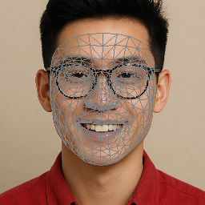
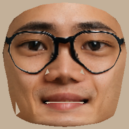

# Face UV Map Generator

A Python project for generating UV maps from facial images using [MediaPipe](https://github.com/google/mediapipe) and facial landmarks.

<table align="center">
  <tr>
    <td>
      
    </td>
    <td align="center" valign="middle" style="font-size:64px; padding: 0 20px;">
      ➡️
    </td>
    <td>
      
    </td>
    <td>
      
    </td>
  </tr>
</table>


## Features

- Face detection and cropping with MediaPipe.
- Face landmark extraction using FaceMesh.
- UV map generation based on predefined triangle mesh.
- Output of:
  - Annotated face image
  - UV map image
  - Mask image

## Folder Structure

```

face\_uvmap/
├── image_preparation/       # Face detection & preprocessing
├── face_mesh/               # Face landmark extraction
├── uv_generator/            # UV map creation
├── config.py                # Configuration (image size, paths, etc.)
├── main.py                  # Main script for batch processing
└── README.md

````

## Setup

### 1. Clone this repository

```bash
git clone https://github.com/your-username/face_uvmap.git
cd face_uvmap
````

### 2. Create and activate a virtual environment (optional but recommended)

```bash
conda create -n face_uv python=3.10
conda activate face_uv
```

### 3. Install dependencies

```bash
pip install -r requirements.txt
```

> If `requirements.txt` is missing, install manually:

```bash
pip install opencv-python mediapipe numpy matplotlib
```

## Configuration

Edit `config.py` to match your folder structure:

```python
IMAGE_FOLDER = "./input_images"
SAVE_FOLDER = "./output"
IMG_SIZE = 256
```

## Usage

Place your face images in the `IMAGE_FOLDER` path and run:

```bash
python main.py
```

The script will:

1. Detect faces and crop them.
2. Annotate landmarks.
3. Generate a UV map.
4. Save the results into the specified output folders.

## Output

* `output/`: Annotated face images & masks
* `output/uv/`: UV map images

## Example

```bash
Processing: ./input_images/sample1.jpg
→ Detected face and saved annotated image
→ UV map generated and saved
```

## License

This project is licensed under the MIT License. See [LICENSE](LICENSE) for details.

## Acknowledgements

* [MediaPipe by Google](https://github.com/google/mediapipe)
* [OpenCV](https://opencv.org/)
* [NumPy](https://numpy.org/)


